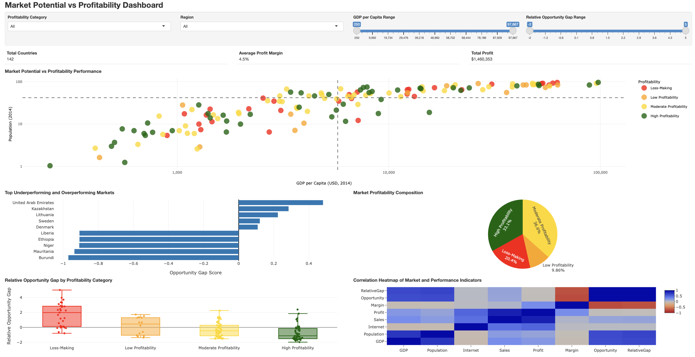
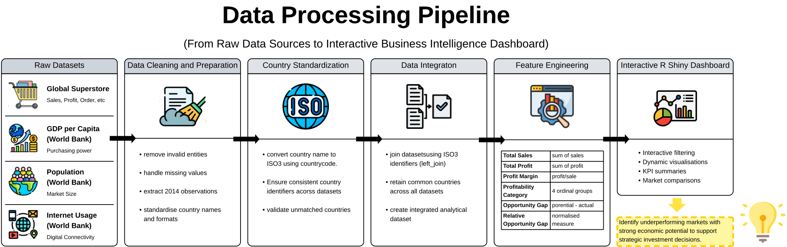

# Market Potential Analytics Dashboard


An interactive R Shiny dashboard for evaluating international market performance by integrating business sales data with external economic indicators. The dashboard helps identify markets that may be underperforming relative to their economic potential, enabling more informed investment and expansion decisions.

---

## Overview

Business performance alone does not always reflect a market's true potential. Countries with favourable economic conditions may still generate relatively poor profitability due to operational inefficiencies, competitive pressures, or ineffective business strategies.

This project combines Global Superstore transactional data with external economic indicators from the World Bank to evaluate whether current market performance aligns with each country's underlying economic potential.

Rather than relying solely on profit, the dashboard introduces an **Opportunity Gap** metric that compares expected market potential against realised business performance, helping decision-makers identify markets that may warrant further investigation.

---

## Business Problem

Global Superstore operates across numerous international markets with varying levels of economic development, population size, and digital connectivity.

Traditional performance evaluation often focuses only on current profitability. However, markets with relatively low profits today may still possess strong long-term growth opportunities.

This dashboard addresses the following question:

> **Which markets are underperforming relative to their economic potential?**

By integrating business performance with macroeconomic indicators, the dashboard supports a more data-driven approach to evaluating international markets.

---

## Dashboard Preview

<a href="images/dashboard_preview.png">
  
</a>

**Figure 1.** Interactive R Shiny dashboard for analysing international market potential and profitability.

---

## Using the Dashboard

The dashboard supports interactive exploration through:

- **Profitability Category** dropdown
- **Region** dropdown
- **GDP per Capita Range** slider
- **Relative Opportunity Gap Range** slider
- Interactive Plotly tooltips
- Automatically updated KPI summaries and visualisations

---

## Data Sources

The dashboard integrates one internal business dataset with three external economic datasets.

| Dataset | Purpose |
|----------|----------|
| Global Superstore | Sales and profitability analysis |
| GDP per Capita (World Bank) | Purchasing power |
| Population (World Bank) | Market size |
| Internet Usage (World Bank) | Digital accessibility |

The external datasets use 2014 observations to align with the Global Superstore data.

---

## Data Pipeline

The dashboard follows an end-to-end analytics workflow that transforms raw business and economic datasets into actionable business insights.



**Figure 2.** End-to-end data processing pipeline used to transform raw business and economic datasets into an integrated analytical dataset for the interactive R Shiny dashboard.

The workflow consists of six stages:

1. Load raw business and economic datasets.
2. Extract 2014 economic indicators.
3. Standardise country names using ISO3 country codes.
4. Integrate internal and external datasets.
5. Perform feature engineering.
6. Generate an interactive R Shiny dashboard for business intelligence and exploratory analysis.

---

## Feature Engineering

Several analytical variables are derived during preprocessing to better evaluate market performance.

| Feature | Description |
|----------|-------------|
| Total Sales | Total revenue generated by each country |
| Total Profit | Total profit generated by each country |
| Profit Margin | Profit divided by total sales |
| Profitability Category | Classifies markets into four profitability groups |
| Opportunity Gap | Difference between market potential and realised profitability |
| Relative Opportunity Gap | Normalised measure of unrealised market potential |

These derived features enable profitability to be analysed relative to underlying economic conditions rather than in isolation.

---

## Dashboard Features

The dashboard contains several interactive visualisations that support strategic market evaluation.

### Market Potential vs Profitability

Compares GDP per capita and population against profitability categories to identify markets whose economic fundamentals differ from current business performance.

### Opportunity Gap Analysis

Ranks markets according to the difference between expected market potential and actual profitability.

### Profitability Composition

Summarises the distribution of countries across profitability categories.

### Relative Opportunity Gap Distribution

Examines how unrealised market potential differs across profitability groups.

### Correlation Analysis

Explores relationships between business performance and macroeconomic indicators.

---

## Technologies

- R
- R Shiny
- Plotly
- ggplot2
- dplyr
- tidyr
- readxl
- countrycode

---

## Project Structure

```text
market-potential-analytics-dashboard/
│
├── app/
│   └── app.R
│
├── data/
│   ├── raw/
│   │   ├── superstore.xlsx
│   │   ├── gdp_per_capita.csv
│   │   ├── population_by_country.csv
│   │   └── internet_user_by_country.csv
│   │
│   └── README.md
│
├── docs/
│   └── market_potential_dashboard_report.pdf
│
├── images/
│   ├── dashboard_preview.png
│   └── data_pipeline.svg
│
├── LICENSE
├── README.md
└── .gitignore
```

---

## How to Run

### 1. Clone the repository

```bash
git clone https://github.com/darrenchenhw0212/market-potential-analytics-dashboard.git
cd market-potential-analytics-dashboard
```

### 2. Install the required packages

```r
install.packages(c(
  "shiny",
  "plotly",
  "ggplot2",
  "dplyr",
  "tidyr",
  "readxl",
  "countrycode"
))
```

### 3. Launch the dashboard

Open RStudio (or any R environment), set the working directory to the project root, and run:

```r
shiny::runApp("app")
```

> **Note:** The dashboard expects the repository folder structure to remain unchanged because datasets are loaded using relative paths from the `data/raw/` directory.

---

## Skills Demonstrated

This project demonstrates:

- Business Intelligence
- Interactive Dashboard Development
- Data Integration
- Data Cleaning and Transformation
- Feature Engineering
- Exploratory Data Analysis
- Data Visualisation
- Decision Support Analytics
- Storytelling with Data

---

## Future Improvements

Potential extensions include:

- Integrating live economic data through public APIs
- Supporting additional economic indicators
- Adding predictive forecasting models
- Introducing drill-down analysis at regional and product levels
- Exporting automated management reports

---

## Acknowledgements

The workflow diagrams in this repository were designed by the author using Lucidchart.

Selected icons are sourced from SVG Repo and Flaticon under their respective licenses.

---

## License

This project is licensed under the MIT License.

See the `LICENSE` file for details.